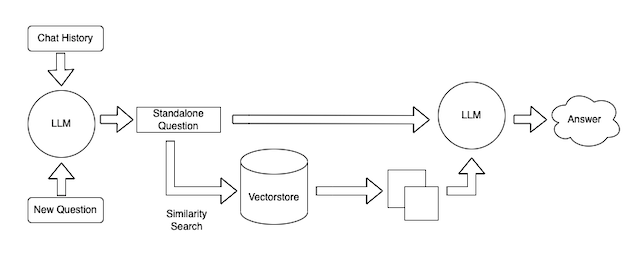

# langchain-my-data-assistant

# Overview

**Value**: Allows the user to query their own data with an open-source LLM.

**Approach**: Use Langchain to upload personal data to a vector store and uses a Hugging Face LLM to
query the data. Note you could adapt the library to use closed source models e.g. from the OpenAI API etc

[Image souce](https://blog.langchain.dev/retrieval/)

# Installation

1. Create .env file in the root directory with the following code
`HUGGINGFACEHUB_API_TOKEN="<your_hugging_face_api_key>"`
2. Add any personal data you wish to query to the `data/data.txt` file
2. Run `python main.py` on the terminal
3. You will be prompted to query your data
4. To exit type "quit", "q" or "exit"
